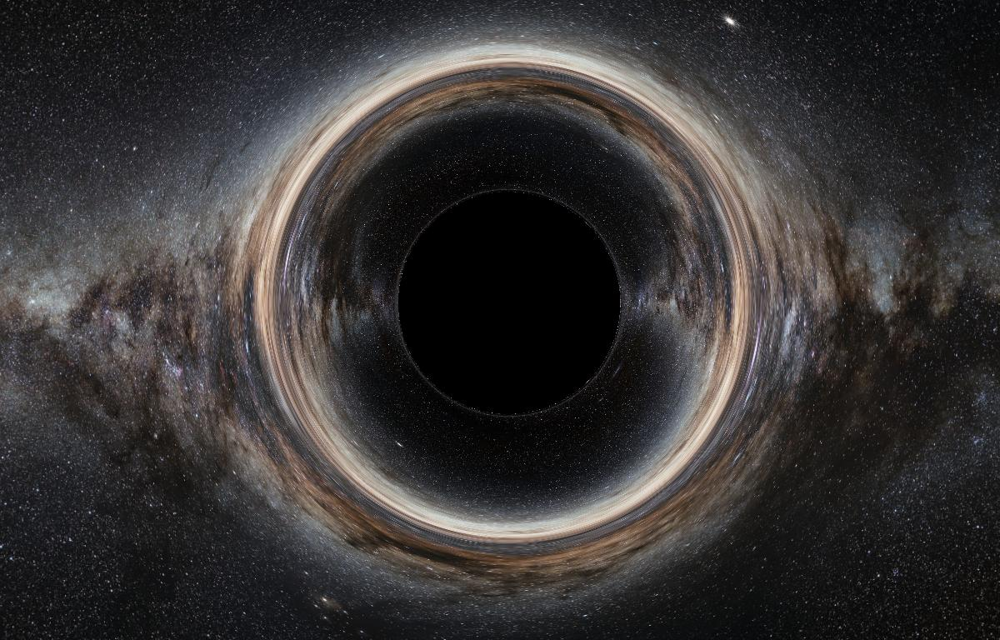

# Real-Time Black Hole Simulator

A real-time, physically-accurate black hole simulator built with Rust and WebGPU. This application visualizes spinning Kerr black holes using advanced general relativity physics, featuring gravitational lensing, frame-dragging effects, and interactive controls for exploring black hole dynamics.



## Features

- ✅ **Kerr Black Hole Physics** - Accurate simulation of rotating black holes with configurable mass and spin
- ✅ **Real-Time Ray Tracing** - GPU-accelerated light ray simulation through curved spacetime
- ✅ **Frame-Dragging Effects** - Visualizes the Lense-Thirring effect from spinning black holes
- ✅ **Gravitational Lensing** - Accurate distortion of background starfield
- ✅ **Interactive Debug Controls** - Real-time sliders for FOV, mass, spin, and ray steps
- ✅ **Cross-Platform** - Runs natively and in web browsers via WebAssembly
- ✅ **Multi-Input Support** - Keyboard, mouse, and touch controls
- ✅ **Responsive Design** - Adapts to different screen sizes and orientations

## Quick Start

### Prerequisites
- [Nix](https://nixos.org/download.html) (recommended)
- Or: Rust toolchain with wasm32 target, Node.js 22+, wasm-pack

### Development Setup

```bash
# Using Nix (recommended)
nix develop
cd www
npm install
npm run serve

# Or manually
rustup target add wasm32-unknown-unknown
cargo install wasm-pack
cd www
npm install
npm run serve
```

Open http://localhost:8080 in your browser.

### Production Build

```bash
cd www
npm run build
# Static files generated in www/dist/
```

## Controls

### Movement
- **W/A/S/D** - Move forward/left/backward/right
- **Space/Shift** - Move up/down  
- **Mouse Wheel** - Move forward/backward
- **Q/E** - Turn left/right
- **Mouse Drag** - Look around (desktop)
- **Touch** - Left half: movement joystick, Right half: look around (mobile)

### Visual Toggles
- **B** - Cycle background modes (starfield/procedural/none)
- **G** - Toggle coordinate grid overlay
- **F** - Toggle FPS counter
- **?** - Toggle help and debug menu

### Debug Controls (in help menu)
- **FOV Slider** - Adjust camera field of view (10° - 120°)
- **Mass Slider** - Change black hole mass (0.1 - 5.0)
- **Spin Slider** - Set black hole rotation (-1.0 to 1.0)
- **Ray Steps** - Adjust rendering quality/performance (50 - 1000)

## Physics Implementation

### Kerr Black Hole Model
The simulator implements a spinning Kerr black hole with:
- **Event Horizon**: `r = M + √(M² - a²)` where `a = spin × mass`
- **Frame-Dragging**: Lense-Thirring effect causing spacetime rotation
- **Adaptive Ray Marching**: Step size adjusts based on gravitational field strength

### Ray Tracing Method
- **Backward Ray Tracing**: Traces light paths from camera to determine pixel colors
- **Geodesic Integration**: Simulates light following curved spacetime paths
- **Gravitational Acceleration**: `F = 1.5 × rs / r²` with frame-dragging correction
- **Escape Condition**: Rays beyond 200× black hole mass distance sample background

### Rendering Pipeline
- **Fragment Shader**: GPU-accelerated ray tracing for each pixel
- **Camera System**: Dynamic FOV with proper perspective projection
- **Uniform Buffers**: Real-time parameter updates from UI controls
- **Background Sampling**: Equirectangular starfield mapping with coordinate grid

## Project Architecture

```
black-hole-laboratory/
├── simulation/          # Physics calculations
│   └── src/lib.rs      # Kerr metric, geodesics, integration
├── renderer/           # Graphics and interaction
│   ├── src/
│   │   ├── lib.rs      # Main renderer (WASM entry)
│   │   ├── main.rs     # Native binary
│   │   ├── camera.rs   # Camera system and controls
│   │   └── shader.wgsl # GPU ray tracing shader
│   └── milkyway.jpg    # Background starfield texture
├── www/                # Web frontend
│   ├── index.html      # UI and debug controls
│   ├── bootstrap.js    # WASM initialization
│   └── package.json    # Build configuration
├── Dockerfile          # AWS Amplify build environment
└── amplify.yml         # Deployment configuration
```

### Simulation Crate
- **KerrBlackHole**: Mass, spin, horizon calculations
- **ConservedQuantities**: Energy, angular momentum, Carter's constant
- **AdaptiveRK45**: Numerical integration with error control
- **KerrLightRay**: Geodesic ray tracing implementation

### Renderer Crate
- **Cross-Platform**: Native development + WebAssembly deployment
- **WebGPU Backend**: Hardware-accelerated graphics via wgpu
- **Real-Time Parameters**: Live updates from JavaScript UI sliders
- **Input Handling**: Unified system for keyboard, mouse, and touch

## Deployment

### Static Hosting
The project builds to static files compatible with any hosting service:

```bash
cd www && npm run build
# Upload www/dist/ contents to your hosting provider
```

### AWS Amplify
Configured for automated deployment with custom Docker build image:

1. Build and push custom image:
```bash
docker build -t your-username/black-hole-sim:latest .
docker push your-username/black-hole-sim:latest
```

2. Connect repository to AWS Amplify
3. Set custom build image in advanced settings
4. Amplify uses `amplify.yml` for automated builds

## Technical Details

### Performance Optimizations
- **Adaptive Step Size**: Smaller steps near black hole, larger steps at distance
- **Early Ray Termination**: Stops tracing when rays hit event horizon or escape
- **GPU Parallelization**: Fragment shader processes all pixels simultaneously
- **Efficient Memory Layout**: Optimized uniform buffer structures for GPU

### Browser Compatibility
- **WebGL 2.0** support required
- **WebAssembly** with threading support
- **Modern browsers**: Chrome 57+, Firefox 52+, Safari 11+, Edge 79+

### Mobile Support
- **Responsive Design**: Adapts to viewport size with device pixel ratio
- **Touch Controls**: Virtual joystick for movement, drag for camera
- **Performance Scaling**: Automatic quality adjustment based on device capabilities

## Development

### Building Components

```bash
# Build WASM package
wasm-pack build renderer --target web

# Run native version
cargo run -p renderer

# Run tests
cargo test

# Format code
cargo fmt && cargo clippy
```

### Debug Features
- **Real-time FPS counter**: Accurate framerate calculation using performance.now()
- **Position/velocity display**: Current camera state information
- **Parameter visualization**: Live values for all physics parameters
- **Grid overlay**: Coordinate reference system

## Future Roadmap

While the current implementation provides a sophisticated foundation with accurate Kerr black hole physics, there are exciting opportunities for visual enhancements and deeper physical modeling:

### Physically-Based Accretion Disk
- **Shakura-Sunyaev Model**: Replace visual placeholder with physically-motivated accretion disk
- **Novikov-Thorne Temperature Profile**: Calculate realistic disk temperature based on orbital dynamics
- **ISCO-Dependent Structure**: Inner disk edge determined by spin-dependent Innermost Stable Circular Orbit
- **Efficient Ray-Disk Intersection**: Optimized algorithms for real-time performance

### Advanced Relativistic Effects
- **General Relativistic Magnetohydrodynamics (GRMHD)**: Model plasma and magnetic field dynamics
- **Relativistic Optics**: Implement comprehensive light emission effects:
  - **Gravitational Redshift**: Energy loss as photons escape gravitational well
  - **Relativistic Doppler Effect**: Frequency shifts from orbital motion
  - **Relativistic Beaming**: Directional focusing enhancing approaching-side brightness
- **Blackbody Radiation**: Map temperature to realistic colors using Planck's law

### Jets and Magnetospheric Effects
- **Blandford-Znajek Mechanism**: Model energy extraction from rotating black holes
- **Relativistic Jets**: Simulate high-energy particle beams along spin axis
- **Magnetic Field Visualization**: Show field lines and plasma dynamics
- **Ergosphere Effects**: Visualize frame-dragging in the ergosphere region

### Performance & Accuracy Improvements
- **GPU Geodesic Integration**: Migrate CPU-based Kerr calculations to compute shaders
- **Precomputed Tables**: Ray deflection lookups and intersection caching
- **Adaptive Quality**: Dynamic ray step adjustment based on device performance
- **Multi-Scale Rendering**: Efficient handling of vastly different length scales

## Contributing

1. Fork the repository
2. Create a feature branch (`git checkout -b feature-name`)
3. Make your changes
4. Add tests for new functionality
5. Run `cargo test && cargo clippy`
6. Submit a pull request

## Acknowledgements

- **Milky Way background**: © 2009 [European Southern Observatory](http://www.eso.org/) (S. Brunier) under [CC BY 4.0](https://creativecommons.org/licenses/by/4.0/)
- **WebGPU Implementation**: Built with [wgpu-rs](https://github.com/gfx-rs/wgpu) graphics library